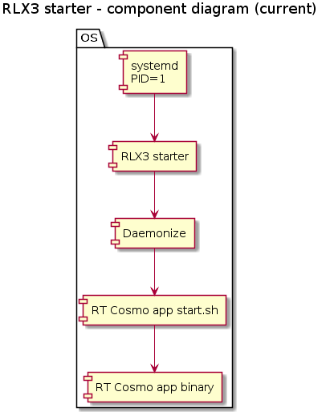
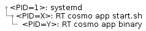
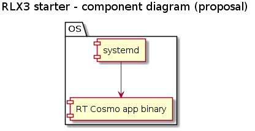

# RLX3 starter proposal

## Overview

The purpose of this document is to create a proposal for the RT cosmo application management /start, stop, restart, etc/.

Find below the current state and the proposals for the RT cosmo application managements.

## Current state

The RT cosmo application is managed by rlx3-starter as depicted on the figure below.

This solution ends up with the following processes on the system.

### Drawbacks
- daemonize package is required
- several process are running on top of the RT cosmo application
- service unit file is separated from the RT cosmo application

## Proposal #1 - remove daemonize

The RT cosmo application is managed by rlx3-starter as depicted in the figure below. The only difference is that daemonize is not used anymore.

This solution ends up with the following processes on the system.

### Drawbacks
- several process are running on top of the RT cosmo application
- service unit file is separated from the RT cosmo application

## Proposal #2 - remove rlx3-starter

The RT cosmo application is managed directly by systemd as depicted in the figure below. The only difference is that daemonize is not used anymore.

This solution ends up with the following processes on the system.

### Drawbacks
- customer must integrate the service unit file to the RT cosmo application
