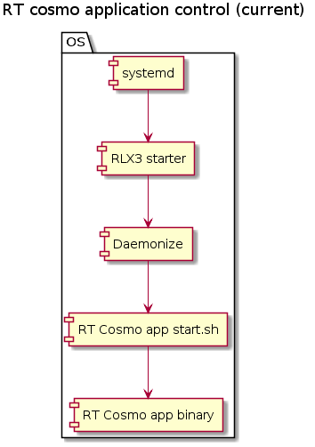

# RT cosmo application control aka RLX3 starter

- [Overview](#overview)
- [Current state](#current-state)
    - [Drawbacks](#drawbacks)
- [Proposal #1 - remove daemonize](#proposal-1---remove-daemonize)
    - [Drawbacks](#drawbacks-1)
- [Proposal #2 - remove rlx3-starter](#proposal-2---remove-rlx3-starter)
    - [Drawbacks](#drawbacks-2)
    - [Impacts](#impacts)
- [Examples](#examples)
    - [Deployment](#deployment)

## Overview

The purpose of this document is to describe a proposal for the RT cosmo application control, e.g. start, stop, status.

Find below the current state and the proposals for the RT cosmo application control.

## Current state

The RT cosmo application is controlled by the ```rlx3-starter``` as depicted in the figure below.



Systemd runs the RLX3 starter. Afterwards the RLX3 starter fires the script ```start.sh``` which basically starts the RT cosmo application.

This solution ends up with the following processes on the system.


***note***: *The RLX3 starter is not in the processes list since the RLX3 starter service unit has Type=```forking``` (hence the RLX3 starter exits as soon as the RT cosmo ```start.sh``` is daemonized).*

### Drawbacks
- daemonize package is required
- several process are running on top of the RT cosmo application
- service unit file is separated from the RT cosmo application package/archive

## Proposal #1 - remove daemonize

The RT cosmo application is controlled by the ```rlx3-starter``` as depicted in the figure below. The difference is that the ```daemonize``` package is not used anymore and the RLX3 starter service unit doesn't have Type=```forking``` (only my assumption).

As far as I know, this proposal is the same as the one in the [Kanbanize story](#TODO:).


This solution ends up with the following processes on the system.


### Drawbacks
- several process are running on top of the RT cosmo application
- service unit file is separated from the RT cosmo application package/archive

## Proposal #2 - remove rlx3-starter

The RT cosmo application is controlled by ```systemd``` directly as depicted in the figure below.


This solution ends up with the following processes on the system.


### Drawbacks
- customer must integrate the service unit file with the RT cosmo application

### Impacts
- the RLX3 starter is completely removed
- ExecStartPre script might be created from scratch

## Examples
I've created a dummy echo server in Python [```service_poc/srv.py```](service_poc/srv.py) to demonstrate described solutions above.
There are three different service units which you can use separately.

### Deployment
```
sudo mkdir /opt/srv/
sudo cp service_poc/* /opt/srv/
sudo mv /opt/srv/*.service /etc/systemd/system/
sudo systemctl enable mysrv_current.service
sudo systemctl enable mysrv_proposal1.service
sudo systemctl enable mysrv_proposal2.service
sudo systemctl start mysrv_current
sudo systemctl start mysrv_proposal1
sudo systemctl start mysrv_proposal2
```

[```mysrv_current```](service_poc/mysrv_current.service) service listens on 0.0.0.0:5553

[```mysrv_proposal1```](service_poc/mysrv_proposal1.service) service listens on 0.0.0.0:5554

[```mysrv_proposal2```](service_poc/mysrv_proposal2.service) service listens on 0.0.0.0:5555
